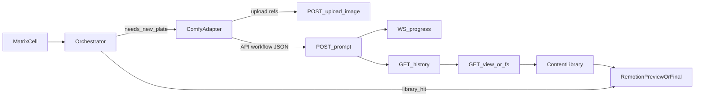

# ATTATTA — ComfyUI Integration

**Status:** Opinionated local-first integration guide  
**Related:** [WORKFLOW-UX-INTEGRATION.md](./WORKFLOW-UX-INTEGRATION.md) · [UX-UI.md](./UX-UI.md) · [PRD.md](./PRD.md) · [assumptions.md](./assumptions.md)

ComfyUI is not “the video editor.” It is ATTATTA’s **generative plate factory**: a node-graph execution engine that turns parameterized workflows into stills/clips for knobs we are allowed to vary (hands, attire, background). Remotion still owns assembly into the ad.

**UX rule:** the infinite node canvas is for **workflow authors** (Workflow Lab / native Comfy app). Marketers and designers use ATTATTA’s simplified cockpit — see [UX-UI.md](./UX-UI.md).

---

## 1. How ComfyUI actually works

### Mental model

```text
Canvas UI  ──┐
curl/SDK   ──┼──►  PromptServer (:8188) ──► Queue ──► PromptExecutor ──► output files
ATTATTA orch ─┘              │
                             ├── WebSocket /ws  (progress, node events)
                             └── REST /history  (final outputs)
```

- ComfyUI is a **workflow engine with an HTTP/WebSocket server**. The drag-and-drop canvas is just one client.
- A “prompt” in the API sense means the **entire node graph JSON**, not the text string inside a CLIP node.
- Execution is **async**: `POST /prompt` returns a `prompt_id` immediately; results come later via WebSocket and/or `GET /history/{prompt_id}`.
- Default listen address: `http://127.0.0.1:8188` (no auth by default — keep local or put behind a proxy later).

### Two workflow JSON formats (critical)

| Format | Use | Contents |
|--------|-----|----------|
| **UI workflow** | Open/edit in Comfy canvas | Nodes + positions, groups, visual links |
| **API format** | What ATTATTA must `POST` | Executable graph only: node id → `{ class_type, inputs }` |

Export API format from ComfyUI: **Settings → Enable Dev Mode → Save (API Format)**.  
First-time integrations almost always fail by posting UI JSON to `/prompt`.

API-format sketch:

```json
{
  "3": {
    "class_type": "KSampler",
    "inputs": {
      "seed": 42,
      "steps": 20,
      "model": ["4", 0],
      "positive": ["6", 0],
      "negative": ["7", 0],
      "latent_image": ["5", 0]
    }
  }
}
```

Links are `[source_node_id, output_index]` tuples inside `inputs`.

### Execution lifecycle

1. Client opens `ws://host:8188/ws?clientId=<uuid>` (optional but recommended).  
2. Client `POST /prompt` with `{ prompt, client_id }` (same uuid).  
3. Server validates graph; on failure returns `error` + `node_errors`.  
4. Job enters queue; WebSocket emits `status`, `execution_start`, `executing`, `progress`, `executed`, …  
5. When `executing` arrives with `node: null` for that `prompt_id`, run is done.  
6. Client `GET /history/{prompt_id}` → output filenames.  
7. Client `GET /view?filename=…&subfolder=…&type=output` to fetch bytes (or read from Comfy’s `output/` folder on the same machine).

Caching: ComfyUI caches node results. Unchanged subgraphs can return `execution_cached` — good for matrix cells that share a BG plate.

---

## 2. Endpoints ATTATTA will use

| Endpoint | Role in ATTATTA |
|----------|-----------------|
| `POST /prompt` | Queue a parameterized workflow for a matrix cell / knob job |
| `GET /history/{prompt_id}` | Collect output paths + meta when done |
| `GET /view` | Pull generated image/video into our library store |
| `POST /upload/image` | Push product refs, masks, Ted plates (for attire/BG only) into Comfy `input/` |
| `GET /queue` | Render-queue UI (pending/running) |
| `POST /interrupt` | Cancel current gen from Review / Queue screen |
| `POST /queue` | Clear or delete queued jobs |
| `GET /object_info` | Validate custom nodes exist before run (CI/bootstrap) |
| `GET /system_stats` | GPU/VRAM health for operator estimate |
| `WS /ws` | Live progress on Render Queue screen |

Optional later: `/free` to unload models between batches.

---

## 3. Where ComfyUI sits in ATTATTA



**Comfy owns:** generative pixels for open knobs (hands primary; attire/BG secondary).  
**Comfy does not own:** story assembly, copy, design tokens, Celtra matrix, face/voice synthesis for Ted.

### Allowed ATTATTA workflows (versioned artifacts)

| Workflow id | Knob | Inputs (examples) | Output | Contract |
|-------------|------|-------------------|--------|----------|
| `hands_product_v1` | Hands | product still/ref, motion hint, BG hint, seed | MP4 or image sequence → encode | No talent face |
| `talent_attire_v1` | Attire | Ted plate + wardrobe ref/mask | Still/clip with face protected | Must use face-lock mask / inpaint exclusion |
| `talent_bg_v1` | Background | Ted plate + BG prompt/ref | Re-sited plate | Face region preserved |
| `theme_plate_v1` | Opening theme plates (PoC demo B) | style params, seed | 1–2 short clips for template head | No Ted performance gen |

Each workflow is a **folder** under `comfy/workflows/<workflowId>/` with a `manifest.json` plus **per-model-profile** API graphs (see §3.1).

### 3.1 Model-agnostic profiles (swap without rewriting the app)

ATTATTA never hardcodes “always use model X” in orchestrator logic. It resolves:

```text
batch.modelProfileId
  └─ default: COMFY_MODEL_PROFILE / registry.defaultProfileId
        └─ z_image_turbo   ← primary (first choice)
        └─ sdxl            ← alternate
        └─ flux_schnell    ← alternate
```

Registry: [`comfy/models.registry.json`](../comfy/models.registry.json)  
Layout notes: [`comfy/README.md`](../comfy/README.md)

| Profile id | Model | Role |
|------------|-------|------|
| `z_image_turbo` | Tongyi Z-Image-Turbo (Comfy-Org pack) | **Default** — fast photoreal plates |
| `sdxl` | SDXL 1.0 | Alternate — ControlNet/LoRA experiments |
| `flux_schnell` | FLUX.1 Schnell | Alternate — quality A/B, Apache license |

**Resolution path for a gen job:**

```text
workflowId + modelProfileId
  → comfy/workflows/<workflowId>/manifest.json   (compatibleProfiles check)
  → comfy/workflows/<workflowId>/<profileId>.api.json
  → comfy/workflows/<workflowId>/<profileId>.map.json
  → ComfyAdapter patches semantic knobs → POST /prompt
```

**Swap UX:** Admin / batch setting shows profile **labels** (“Z-Image-Turbo”, “SDXL”). Operators do not pick UNET/VAE filenames. Creative techs author one API-format graph per profile they want supported.

**Lineage must record** `modelProfileId` + `workflowId` + `workflowHash` + seed (so Review knows which stack produced a plate).

---

## 4. ATTATTA ComfyAdapter (how we integrate)

### Responsibilities

1. Load workflow template (API format) by `workflowId`.  
2. Patch only allowlisted node inputs from the matrix cell / knob job.  
3. Upload required refs via `/upload/image` when needed.  
4. `POST /prompt` with shared `client_id`.  
5. Track via WebSocket; fall back to history poll.  
6. Copy outputs into `library/gen/<knob>/…` and write lineage sidecar.  
7. Return `assetId` to orchestrator for Remotion props.

### Param patching pattern

Never hand-edit full graphs at runtime. Treat workflows as templates:

```json
{
  "workflowId": "hands_product_v1",
  "patches": {
    "12.inputs.seed": 42,
    "6.inputs.text": "hands presenting smartphone, soft daylight desk",
    "10.inputs.image": "product_phone_x.png"
  },
  "cellId": "cmp_spring_012",
  "knob": "hands"
}
```

Adapter resolves dotted paths → node id / input key, then submits.

### Orchestrator-facing job (replaces vague conceptual blob)

```json
{
  "jobId": "gen_hands_cmp_spring_012",
  "workflowId": "hands_product_v1",
  "modelProfileId": "z_image_turbo",
  "cellId": "cmp_spring_012",
  "knob": "hands",
  "patches": {
    "seed": 42,
    "productRef": "sku_phone_x.png",
    "motionToken": "gesture_medium_v1",
    "backgroundHint": "soft daylight desk"
  },
  "priority": "normal"
}
```

Adapter maps semantic patches → node ids using  
`comfy/workflows/hands_product_v1/<modelProfileId>.map.json`  
(e.g. `z_image_turbo.map.json`). Omit `modelProfileId` → use `COMFY_MODEL_PROFILE` / registry default.

### Lineage sidecar (required)

```json
{
  "assetId": "hands_gen_20260805_a3f9",
  "source": "comfyui",
  "promptId": "a3f9e2b1-4c5d-4e6f-8a9b-0c1d2e3f4a5b",
  "workflowId": "hands_product_v1",
  "modelProfileId": "z_image_turbo",
  "workflowHash": "sha256:…",
  "patches": {},
  "seed": 42,
  "createdAt": "2026-08-05T21:00:00Z",
  "contractFlags": { "touches_face": false, "touches_voice": false }
}
```

### Hard guardrails

- Refuse to run any workflow whose manifest has `touches_face: true` or `touches_voice: true` against locked talent.  
- `talent_attire_v1` / `talent_bg_v1` must declare a **face protect** strategy (mask node ids) in the map file; CI checks those nodes exist via `/object_info`.  
- Prefer regenerating **hands** over forcing attire/BG when lighting mismatch is likely (flat-lit Ted library).

---

## 5. Client execution pattern (recommended)

```text
1. Ensure ComfyUI running locally (python main.py --listen 127.0.0.1 --port 8188)
2. GET /system_stats  → fail fast if GPU unhappy
3. GET /object_info   → verify workflow node classes present (bootstrap)
4. For each gen job:
   a. Upload refs (POST /upload/image) if not already on server
   b. Clone API workflow JSON + apply patches
   c. POST /prompt { prompt, client_id }
   d. Wait on WS until executing.node == null for prompt_id
   e. GET /history/{prompt_id}
   f. Fetch /view (or copy from output/) → library/gen
   g. Write lineage sidecar; return assetId
5. On operator cancel: POST /interrupt (+ optional queue delete)
```

**Preview vs final:** Dynamic Preview should prefer **library hits** and skip Comfy when possible. Only queue Comfy for cells marked `needs_gen` after preview cohesion passes (or when operator explicitly re-rolls a knob).

**Batching:** One Comfy server = one heavy GPU consumer. Orchestrator should:

- Deduplicate identical patch sets across matrix cells (shared BG plate).  
- Queue hands gens serially or small parallel if VRAM allows.  
- Never stampede N identical workflows without cache keys.

---

## 6. Mapping to operator knobs & UX

| Operator action | Comfy behavior |
|-----------------|----------------|
| First batch, hands open | Queue `hands_product_v1` per unique hands treatment |
| Swap hands on Review | New job, new seed or different product/motion patches |
| Re-roll gen | Same workflow + patches, new seed; keep lineage parent |
| Rewrite copy only | **No Comfy** — Remotion re-encode |
| Swap talent take | **No Comfy** — library select |
| Change attire / BG | `talent_attire_v1` / `talent_bg_v1` with face protect |
| Preview bay | Skip Comfy if placeholder/library plate exists |

Render Queue UI binds to WebSocket `progress` / `executing` for the active `prompt_id`.

---

## 7. PoC workflow build plan (Comfy-specific)

### Demo B (from creative-tech brief)

Ship **two** short theme/hands plates used at the head of the Remotion template:

1. Author graphs in Comfy on **Z-Image-Turbo**; export **API format**.  
2. Check in `comfy/workflows/theme_plate_v1/z_image_turbo.api.json` (+ `.map.json` + `manifest.json`).  
3. Expose 3–5 tweak knobs: seed, style prompt, motion intensity, product ref, duration/frames.  
4. ATTATTA CLI: `atta gen --workflow theme_plate_v1 --profile z_image_turbo --seed 42` → library path.  
5. Remotion template consumes those paths as `handsClip` / `openPlate`.  
6. Later: add `sdxl.api.json` / `flux_schnell.api.json` beside it for A/B — same semantic patches.

### Then

1. `hands_product_v1` as primary matrix fan (**z_image_turbo** first).  
2. Optional `talent_bg_v1` with strict face mask.  
3. Attire last (hardest to keep identity-safe).  
4. Second profile only when you want a quality/ecosystem comparison — not required for PoC.

### Custom nodes / models

Pin a **known-good** custom-node set + model list in `comfy/README.md` (checkpoint, any video helper nodes). Bootstrap script calls `/object_info` and fails if missing. Do not assume every machine has the same nodes.

---

## 8. Local ops

```bash
# Typical local start (developer machine)
cd ComfyUI
python main.py --listen 127.0.0.1 --port 8188
```

ATTATTA env (see [`.env.example`](../.env.example); real values in local `.env` only):

```bash
COMFY_API_KEY=comfyui-…          # from platform.comfy.org — never commit
COMFY_BASE_URL=http://127.0.0.1:8188
COMFY_WORKFLOWS_DIR=./comfy/workflows
COMFY_MODEL_PROFILE=z_image_turbo   # or sdxl | flux_schnell
```

### API key usage

Comfy Platform keys (`comfyui-…`) are used in two ways:

| Target | How to pass the key |
|--------|---------------------|
| **Comfy Cloud** (`https://cloud.comfy.org`) | Header `X-API-Key: $COMFY_API_KEY` on every request; WebSocket may use `token` query param |
| **Local ComfyUI + Partner Nodes / headless** | Include in prompt body: `extra_data.api_key_comfy_org: $COMFY_API_KEY` |

`ComfyAdapter` should:

1. Read `COMFY_API_KEY` from the environment (never hardcode).  
2. If `COMFY_BASE_URL` is Cloud → send `X-API-Key`.  
3. If local → attach `extra_data.api_key_comfy_org` when Partner Nodes need it.  
4. Redact the key from logs, lineage sidecars, and review manifests (store `auth: "env:COMFY_API_KEY"` only).

Security note: stock **local** Comfy has **no server auth** by default — bind to `127.0.0.1` for PoC. The Platform API key authenticates to **Comfy Org / Cloud / Partner Nodes**, not as a substitute for locking down a public local port. Hosted phase still needs reverse proxy + auth.

---

## 9. Failure modes to design for

| Failure | Operator-facing behavior |
|---------|--------------------------|
| Validation `node_errors` | Show which knob/workflow broke; do not silently skip |
| OOM / CUDA | Mark cell failed; suggest `/free` or smaller batch |
| Missing custom node | Bootstrap error before queueing matrix |
| Timeout | Allow retry once; then `failed` for Review |
| Face-lock violation attempt | Hard block with contract message |
| Cached unexpected output | Include `workflowHash` + seed in lineage; force seed bump on re-roll |

---

## 10. What “done” looks like for Comfy in ATTATTA

- [ ] At least one API-format workflow checked in and runnable via adapter.  
- [ ] Matrix cell can request `handsJob` and receive a library `assetId` with lineage.  
- [ ] Remotion final render uses that asset in the punchline slot.  
- [ ] Review “Re-roll gen” changes seed and regenerates only that knob.  
- [ ] No path exists that submits a face-touching workflow against Ted locks.  
- [ ] Render Queue shows live Comfy progress over WebSocket.

---

## References

- ComfyUI server routes overview: [docs.comfy.org — comms routes](https://docs.comfy.org/development/comfyui-server/comms_routes)  
- Official API examples: [docs.comfy.org — api-examples](https://docs.comfy.org/development/comfyui-server/api-examples)  
- Workflow JSON spec: [docs.comfy.org — workflow_json](https://docs.comfy.org/specs/workflow_json)  
- OpenAPI: [Comfy-Org/ComfyUI openapi.yaml](https://github.com/Comfy-Org/ComfyUI/blob/master/openapi.yaml)  
