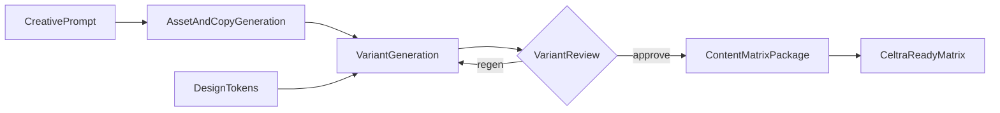
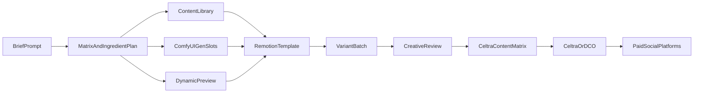

# ATTATTA — Product Requirements Document (v0.1)

**Status:** Opinionated draft (enriched from Celtra hopper brief + architecture diagrams + Celtra boundary research)  
**Working nickname:** Celtra hopper — approved ingredients in the top; Celtra-ready package out the bottom  
**Last updated:** 2026-08-05  
**Source of truth:** this document  
**Related:** [APP.md](./APP.md) · [assumptions.md](./assumptions.md) · [WORKFLOW-UX-INTEGRATION.md](./WORKFLOW-UX-INTEGRATION.md) · [UX-UI.md](./UX-UI.md) · [COMFYUI-INTEGRATION.md](./COMFYUI-INTEGRATION.md) · [CELTRA.md](./CELTRA.md) · [briefs/](./briefs/)

---

## 1. Overview

### Problem

Creative and performance teams need many paid-social video variants from one brief. Manual assembly (pick footage, write copy, render, re-package for Celtra) sits between a good idea and fifty versions of it. That work should not require a developer per batch.

### Thesis

**ATTATTA** is the upstream **creative & marketing control** layer. It turns a single brief/prompt into modular video ad variants from **approved libraries** + selective GenAI (hands / attire / BG under talent locks), with sparse testing and human review. Approved masters leave as a **content matrix package**.

**Celtra** is the downstream **distribution & channel activation** layer (trafficking to Meta and other platforms the org already launches through). We deliberately take ideation, modular assembly, generative plates, and creative review *out* of Celtra so marketers/creatives keep control; we do **not** rebuild Celtra’s CMP/DCO studio.

The point is not to remove creative judgement. It is to remove manual assembly between idea and volume — and to stop using Celtra as the place where variant logic is invented.

See [CELTRA.md](./CELTRA.md) for the full boundary.

### Product model (locked mental model)

Every ad is the same three parts. Structure stays stable; contents change:

| Part | Role | Flexibility |
|------|------|-------------|
| **Spokesperson** | Human anchor (contracted talent, e.g. Ted) | Library select + wardrobe/BG AI only; **face, voice, performance locked** |
| **Hands** | Product held / handled / presented | Open: product swap, performance adapt, BG change — primary generative surface |
| **Copy** | Messaging that ties visuals to the offer | LLM-generated within brand rules |

Each variant must read as one story:

1. **Setup** — establishes the scenario  
2. **Punchline** — moment pays off  
3. **End card** — marketing offer, stated clearly  

**Quality bar:** cohesion between visuals and copy. A technically valid combo that tells no story is a failed variant.

### Goals

- Brief once (prompt-led) → batch of reviewable variants without developer support.
- Assemble from approved libraries with selective AI where contracts allow.
- Keep creative review as the place judgement happens (keep / tweak / regen).
- Package approved sets into a **Celtra-ready content matrix** (finished video masters + copy + metadata).
- Use Celtra for **distribution only** (channel packaging / trafficking), not for creative authorship.
- Run **locally** for PoC / early build (no hosting requirement in this phase).

### Non-goals (current phase)

- Hosted multi-user SaaS, auth, or cloud deploy (local-first).
- Replacing Celtra as the enterprise CMP (templates, HTML5, localization studio, ad-tag serving).
- Auto-publish into Meta Ads Manager or Celtra API (matrix export / manual Celtra drop is enough for PoC).
- Full timeline editor or freeform generative “new talent performance.”
- Face / voice / performance synthesis or modification of contracted spokesperson.
- TikTok / YouTube as primary (vertical paid social first; multi-size later).
- Full production DAM features (discovery, state tracking, publishing) — sketched for later, not PoC-critical.
- Native media buying / bid optimization (Celtra + media platforms).

---

## 2. Users & jobs-to-be-done

### Primary: Performance marketer (+ creative technologist in the loop)

| Job | Outcome |
|-----|---------|
| Pour a brief/prompt into the hopper | Structured campaign + variant plan |
| Get volume without hand-building each ad | Batch of modular variants from libraries + AI |
| Steer from what works | Regen / swap ingredients / tweak copy |
| Hand off to delivery | Content matrix Celtra can consume |

### Secondary: Creative reviewer / brand owner

| Job | Outcome |
|-----|---------|
| Curate approved libraries | Only trafficable ingredients enter the hopper |
| Enforce talent contract guardrails | Face/voice/performance never altered |
| Review cohesion | Story holds: setup → punchline → end card |
| Approve for matrix | Only approved variants ship downstream |

### Roles (local PoC)

- **Operator** (marketer or creative tech): prompt, select matrix cells, run batch, export.
- **Reviewer** (creative): approve / reject / regen with reasons.
- Same person is fine locally.

Default: **matrix export includes only approved variants**.

---

## 3. Core concepts

| Concept | Definition |
|---------|------------|
| **Campaign** | Brief + brand tokens + selected template + batches + matrix. |
| **Brief / prompt** | Single creative description of scenario, tone, offer (not only field-by-field forms). |
| **Campaign template** | Remotion (or equivalent) timeline: spokesperson slot → hands/product slot → end card/copy. Workflows are **scoped to templates**. |
| **Design tokens** | Brand system inputs (type, color, end-card chrome, spacing) applied at variant generation. |
| **Content library** | Approved media: Ted/spokesperson takes, hand alts, body-motion references; enriched with AI tags + sentiment; powers **suggestions**. |
| **Ingredient** | One library asset or generated clip eligible for a template slot. |
| **Dynamic preview** | Immediate rough cut before full GenAI/final render. |
| **Content matrix** | Combinatorial plan: rows/columns of ingredient × messaging → variants to render; also the Celtra handoff artifact. |
| **Variant** | One rendered video + copy + metadata for a matrix cell. |
| **Batch** | Render job covering selected matrix cells. |
| **Story beats** | Setup, punchline, end card — must cohere across parts. |
| **Review decision** | `approve` · `reject` · `regen` (+ reason tags). |

---

## 4. User journeys

### 4.1 Experience journey (north-star, from architecture decks)

Canonical nine-stage product experience ([diagram write-up](./briefs/2026-08-05_architecture-diagrams.md)):

1. **Campaign Template** — scope the workflow to a modular template.  
2. **Prompt** — idea grounds ad generation.  
3. **Asset Library** — talent + hands (etc.) with suggestions.  
4. **Dynamic Preview** — rough cut available immediately.  
5. **GenAI Rendering** — AI compositing / asset generation (ComfyUI + LLM).  
6. **Iterations** — reprompt and generate new ads (loop to prompt / variant gen).  
7. **Review Platform** — creative/client feedback (Frame.io in production).  
8. **Automated Tagging** — post-approval metadata on finals (plus separate **ingest** tagging on library — see §5.2).  
9. **Distribution** — hand off package **to Celtra** → Celtra activates channels (IG/FB MVP; other platforms via Celtra’s surface).

### 4.2 Data flow (Celtra hopper contract)

From the Celtra flowchart — this is what ATTATTA must produce:

### 4.3 Local PoC path (what we build first)

1. Operator provides prompt and/or **content matrix** (CSV/JSON): ingredient refs + brand messaging per cell.
2. Apply **design tokens** + library suggestions (stub OK).
3. **Dynamic preview** — fast Remotion rough cut for selected cells.
4. Optional: **ComfyUI** generates/tweaks hands / theme clips.
5. Final **Remotion** render per matrix cell.
6. Local review manifest (approve / reject / regen).
7. Export: videos + **Celtra-shaped** matrix/manifest.

### 4.4 Library enrichment loop (parallel track)

1. Ingest Ted / hands / motion-reference clips into the library.
2. Run **AI tagging + sentiment** on ingest (discovery/suggestions).
3. After approval, tag **finals** again for delivery/organization metadata.
4. Metadata powers suggestion/discovery for the next iteration.

---

## 5. Functional requirements

### 5.1 Brief / prompt ingest

- Accept a **single prompt** describing scenario, tone, offer (primary UX).
- Optionally expand into structured fields (audience, CTA, must-say / must-not-say) for matrix rows.
- Surface gaps before render (missing offer, no CTA, no usable spokesperson take).

### 5.2 Content library

- Store and reference:
  - **Spokesperson (Ted)** takes — flat lighting preferred when face is untouchable.
  - **Hand alt** videos — product presentation performances.
  - **Human body movement** references — for animation / retarget guidance.
- **Two tagging moments:** (1) ingest tags + sentiment for suggestions; (2) post-approval tags on finals for delivery/organization.
- PoC: local folder + JSON metadata sidecar is enough.
- Later: suggestion engine (“library ideas”) for creative iteration.

### 5.3 Design tokens

- First-class input to variant generation (colors, type, end-card layout, optional social chrome).
- Tokens constrain template assembly; not optional chrome only after render.

### 5.4 Content matrix

- Represent combinatorial coverage: e.g. spokesperson take × hands treatment × copy line × offer.
- Support diagram-friendly export (slide) and machine-readable matrix (CSV/JSON).
- Matrix drives Remotion renders; approved subset becomes Celtra package.

### 5.5 Dynamic preview

- Produce an immediate **rough cut** from template + current ingredients/copy before full GenAI/final encode.
- Preview is for steering iterations; final trafficable files come from the full render path.

### 5.6 Template assembly (Remotion)

- Fixed modular template slots: spokesperson → hands/product → end card.
- Inputs: selected library clips and/or ComfyUI outputs + copy + brand design tokens.
- Output: campaign-ready vertical video per matrix cell.
- Parameterize timing, safe zones, typography tokens — not a freeform editor.

### 5.7 Generative slots (ComfyUI)

- Local ComfyUI server as the generative plate engine (see [COMFYUI-INTEGRATION.md](./COMFYUI-INTEGRATION.md)).
- Versioned **API-format** workflows; ATTATTA patches allowlisted inputs (seed, prompts, refs) via `ComfyAdapter`.
- Integration path: `POST /prompt` → WebSocket progress → `GET /history` / `/view` → library asset + lineage.
- Workflow(s) for flexible clips (especially hands/product; optionally spokesperson wardrobe/BG with face protect).
- Never route face/voice/performance synthesis for contracted talent.

### 5.8 Copy generation

- Generate setup/punchline/end-card copy aligned to selected visuals.
- Respect brand voice and banned claims.
- Cohesion check: copy must match scenario implied by spokesperson + hands.

### 5.9 QC & story cohesion

- Spec checks: aspect, duration, audio presence, end-card legibility.
- Contract checks: no face/voice pipeline applied to spokesperson.
- **Story cohesion score** (heuristic/LLM): setup ↔ punchline ↔ offer consistency.
- Failures flagged for review, not silently shipped.

### 5.10 Review

- Preview variants; approve / reject / regen.
- Regen can swap ingredients, re-roll hands gen params, or rewrite copy — not re-synthesize Ted’s face/voice.
- PoC: local review checklist + updated manifest is acceptable (Frame.io later).

### 5.11 Export / Celtra package

- Folder or zip: approved `.mp4`s + content matrix + per-variant copy/metadata.
- Masters are **finished creative**; Celtra should not need to re-author story/talent/hands.
- Shape metadata for Celtra ingestion (field mapping in [CELTRA.md](./CELTRA.md); confirm with Celtra admin).
- Filename: `{campaignSlug}_{matrixCellId}_{aspect}.mp4`.
- Distribution path: ATTATTA package → **Celtra** → platforms. PoC stops at package export (manual Celtra drop).
- Celtra may still resize/repackage for additional placements — that is distribution, not a second creative pass.
---

## 6. Agent & model architecture

### Agents (logical; can be scripts locally)

| Agent | Responsibility | Human gate |
|-------|----------------|------------|
| **Orchestrator** | Matrix → jobs → renders → manifest | — |
| **Brief Analyst** | Prompt → structured brief + matrix seeds | Operator confirms |
| **Ingredient Matcher** | Library search via tags/sentiment → slot candidates | Operator can override |
| **Hands/Gen Director** | ComfyUI params for generative slots | — |
| **Copywriter** | Setup / punchline / end-card copy | — |
| **Cohesion QC** | Story + contract + spec checks | Creative review |

### Model / tool slots

| Slot | Role | Notes |
|------|------|-------|
| `script_llm` | Brief parse, copy, cohesion | OpenAI-class / local |
| `tagging_llm` / vision | Library + final tags / sentiment | Ingest and post-approval |
| `comfy_hands` | Hands/product generative clips | Primary AI surface; **model profile** from registry (default `z_image_turbo`) |
| `comfy_wardrobe_bg` | Spokesperson wardrobe/BG only | No face touch; same profile swap mechanism |
| `remotion_preview` | Fast rough-cut dynamic preview | Separate from final encode |
| `remotion_render` | Final template assembly | Remotion |
| `design_tokens` | Brand token pack applied at variant gen | Required input |
| `motion_ref` | Body motion library lookup | e.g. ActorCore-class refs |

### Talent contract pipeline rules

| Allowed on spokesperson | Forbidden |
|-------------------------|-----------|
| Select different library takes | Face modify / replace / synthesize |
| Wardrobe change via AI | Voice modify / replace / synthesize |
| Background / environment change | New performance generation |
| Color grade that does not alter facial identity | Relight that invents unseen facial detail (**best guess:** avoid; prefer flat-lit source) |

Hands: place any product, adjust performance, change BG freely.

---

## 7. Output specs

### MVP

| Parameter | Default |
|-----------|---------|
| Placement | Paid social vertical (IG/FB) |
| Aspect | **9:16** primary |
| Structure | Spokesperson → hands → end card |
| Codec | H.264 `.mp4` |
| Copy | On-ad text + matrix fields for Celtra primary text / CTA |

### Beyond MVP (design for, don’t build all now)

- Multiple sizes from one approved concept (1:1, 4:5, display).
- Same matrix cell → several dimension variants.

### Export profile presets

- `paid_social_9x16` — MVP  
- `paid_social_4x5` / `paid_social_1x1` — next  
- `display_*` — later  

---

## 8. Non-functional requirements

### Local-first (current phase)

- Runnable on a developer/creative-tech machine: Remotion render + ComfyUI + local library folder.
- No requirement for hosted frontend, shared auth, or cloud workers yet.
- Self-service UX remains a **north-star**; PoC may be CLI + simple local UI.

### Latency & cost (best-guess local targets)

- **Dynamic preview** for a cell: aim for interactive steering (seconds–low minutes), before ComfyUI/final encode.
- Full GenAI + final render: ComfyUI gens dominate wall clock.
- Batch of ~12 cells: complete within a working session on local GPU where possible.
- Cache library tags; don’t re-analyze unchanged assets.

### Compliance & lineage

- Persist ingredient IDs, ComfyUI graph/params, prompts, and review decisions per variant.
- Talent contract flags stored on spokesperson assets (`face_locked`, `voice_locked`, `performance_locked`).

### Reliability

- Idempotent cell renders; re-run failed cells without full matrix restart.

---

## 9. Scope

### PoC must (near-term demos)

- **Demo A:** Script that takes a content matrix (assets + brand messaging + design tokens), lays it into a Remotion video template, renders campaign-ready vertical videos.
- **Demo B:** ComfyUI workflow generating the flexible clips used early in the template (hands / theme variations), with tweakable parameters.
- **Dynamic preview** path for at least one template (rough cut before final encode).
- **Diagrams:** content matrix; end-to-end workflow stages; ComfyUI tasks/dependencies; video generation flow (experience + Celtra flow already sourced — see briefs).
- Local library stub with Ted + hand alts + motion refs + metadata sidecars.
- Simple approve/reject → matrix export for Celtra-shaped handoff.

### Should (still local)

- Prompt → suggested matrix (not only hand-built CSV).
- AI tagging + sentiment on ingest (post-approval tagging can be stubbed).
- Cohesion QC pass before review.
- Wardrobe/BG variation path that never touches face.
- Library suggestion ranking from tags.

### Won’t (this phase)

- Hosting, SSO, multi-tenant access (Azure in journey deck = later).
- Celtra/Meta/DCO auto-publish APIs.
- Full Frame.io-integrated review (note as future dependency).
- Face/voice/performance synthesis for Ted.
- Production-grade asset discovery / publishing suite.
- Direct multi-platform distribution automation (IG/TikTok/Reddit logos = north-star).

### Known hard dependencies (may change)

| Dependency | Why |
|------------|-----|
| [Remotion Enterprise license](https://www.remotion.pro/license) | Template render / company use |
| Human motion library (e.g. [ActorCore](https://actorcore.reallusion.com/3d-motion)) | Body animation references |
| Frame.io | Production review (post-PoC) |
| ComfyUI | Generative variation workflows |
| OpenAI-class LLM | Prompt parse / copy / cohesion (pluggable) |
| Celtra | Downstream **distribution / trafficking** only (see [CELTRA.md](./CELTRA.md)) |
| Azure (later) | Hosted runtime shown in journey deck |

---

## 10. Open questions

From the creative-tech brief, plus product gaps. **Best-guess answers** are recorded in [assumptions.md](./assumptions.md); confirm or override.

1. **Face-untouchable scenarios:** How limited is the scenario space if we cannot relight/alter the face?  
2. **Lighting standard:** Do all Ted shoots need a flat, consistent lighting setup for wardrobe/BG work?  
3. **Camera coverage:** Front essential — how many additional angles per take?  
4. **Motion reference sourcing:** ActorCore-class library vs proprietary capture?  
5. **Phone props:** One device brand across gens, or variable by campaign?  
6. **Social UI chrome:** Static mock UI in-frame, or swappable per campaign?  
7. **Celtra ingest:** Exact path for pre-rendered MP4 masters + metadata (feed vs design file vs API)?  
8. **Celtra sizing:** Does Celtra derive 1:1 / 4:5 from our 9:16 master, or must ATTATTA supply sizes?  
9. **Remotion Enterprise:** Confirmed procurement for this build?

---

## 11. Appendix

### Glossary

- **Celtra hopper:** Nickname for ATTATTA’s pour-in / variants-out workflow.  
- **Ingredient:** Approved or generated clip eligible for a template slot.  
- **Design tokens:** Brand system values applied at variant generation.  
- **Dynamic preview:** Immediate rough cut used to steer before final GenAI/encode.  
- **Content matrix:** Combinatorial plan and Celtra handoff table.  
- **Spokesperson lock:** Contractual ban on face/voice/performance alteration.  
- **Hands slot:** Primary generative flexibility for product moments.  
- **Story cohesion:** Setup + punchline + end card reading as one ad.

### Doc map

| Path | Purpose |
|------|---------|
| [PRD.md](./PRD.md) | Product requirements (this file) |
| [APP.md](./APP.md) | Slice A app runbook |
| [WORKFLOW-UX-INTEGRATION.md](./WORKFLOW-UX-INTEGRATION.md) | Operator workflow, UX flowchart, tool/API integration plan |
| [UX-UI.md](./UX-UI.md) | Simplified operator UI vs Comfy node canvas; screen-by-screen UX |
| [COMFYUI-INTEGRATION.md](./COMFYUI-INTEGRATION.md) | How ComfyUI works and how ATTATTA calls it |
| [comfy/models.registry.json](../comfy/models.registry.json) | Swappable model profiles (`z_image_turbo` default) |
| [CELTRA.md](./CELTRA.md) | Celtra research; ATTATTA owns creative, Celtra owns distribution |
| [assumptions.md](./assumptions.md) | Locked defaults, revisable choices, best guesses |
| [briefs/2026-08-05_celtra-hopper-brief.md](./briefs/2026-08-05_celtra-hopper-brief.md) | Enriched brief (normalized) |
| [briefs/2026-08-05_source-notes.md](./briefs/2026-08-05_source-notes.md) | Raw trace from creative-tech PoC notes + product email |
| [briefs/2026-08-05_architecture-diagrams.md](./briefs/2026-08-05_architecture-diagrams.md) | Interpretation of journey + Celtra flow images |
| [briefs/image-2.png](./briefs/image-2.png) · [image.jpg](./briefs/image.jpg) · [unnamed.jpg](./briefs/unnamed.jpg) · [unnamed.png](./briefs/unnamed.png) | Source architecture images |
| [briefs/](./briefs/) | Future briefs and references |

### Revision history

| Version | Date | Notes |
|---------|------|-------|
| 0.1 | 2026-08-05 | Initial opinionated PRD |
| 0.1.1 | 2026-08-05 | Enriched from Celtra hopper + creative-tech PoC brief; local-first; template/library model |
| 0.1.2 | 2026-08-05 | Folded architecture diagrams: 9-stage journey, dynamic preview, design tokens, dual tagging, Celtra vs DCO/platforms |
| 0.1.3 | 2026-08-05 | Linked operator workflow / UX / integration plan doc |
| 0.1.4 | 2026-08-05 | ComfyUI engine/API integration model documented |
| 0.1.5 | 2026-08-05 | Celtra boundary: ATTATTA creative control; Celtra distribution only |
| 0.1.6 | 2026-08-05 | UX plan: Comfy canvas = authoring only; simplified operator cockpit |
| 0.1.7 | 2026-08-05 | Model-agnostic Comfy profiles; Z-Image-Turbo default |
| 0.1.8 | 2026-08-05 | Slice A app scaffolded (web + orchestrator + Remotion) |
