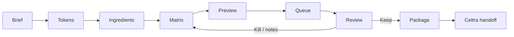
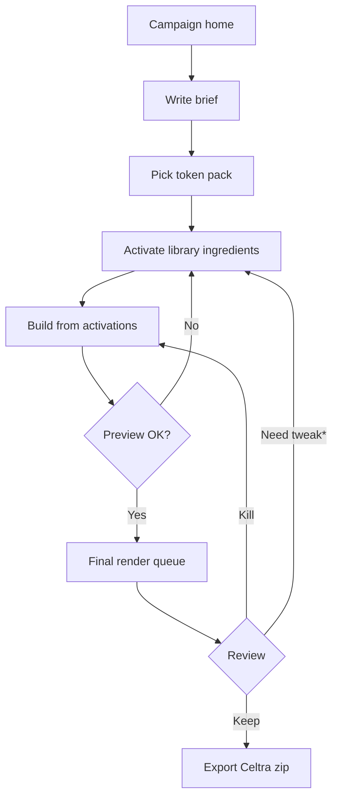
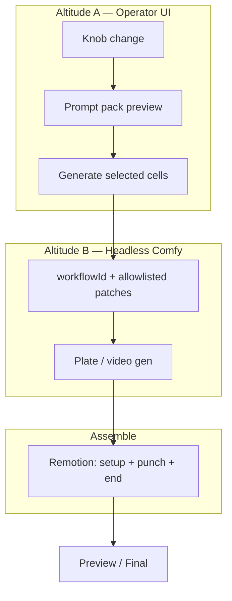
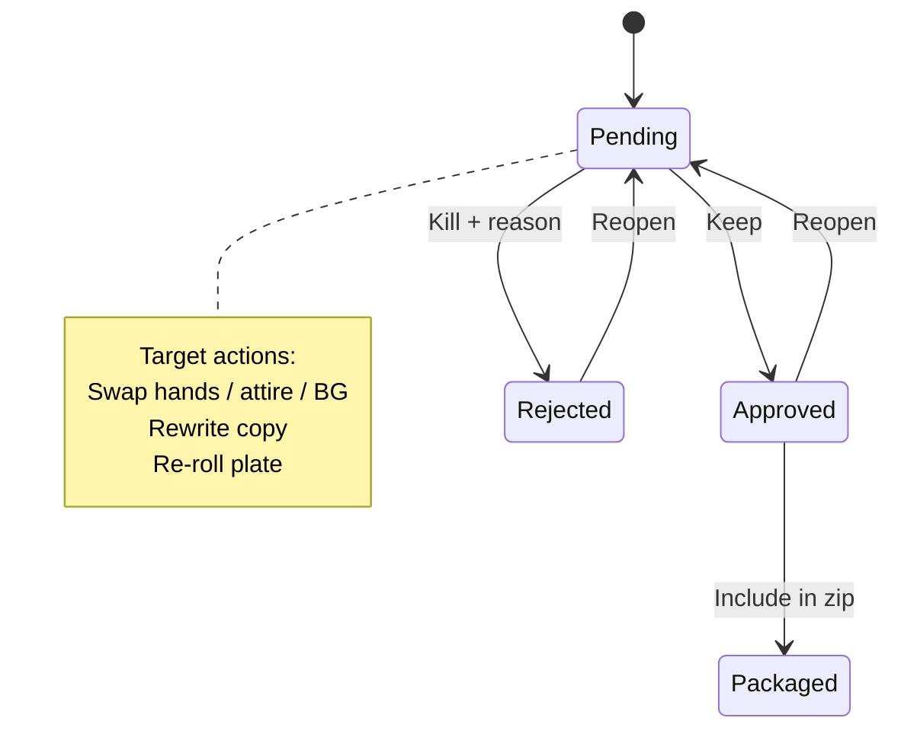
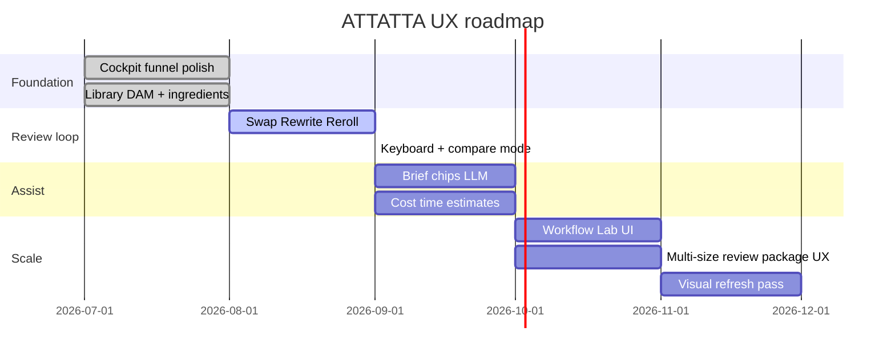

# ATTATTA — UX PRD

**Version:** 0.1  
**Date:** 2026-08-10  
**Audience:** Operators (marketers/designers) primary; creative techs secondary  
**Related:** [PRODUCT-PRD.md](./PRODUCT-PRD.md) · [UX-UI.md](./UX-UI.md) · [WORKFLOW-UX-INTEGRATION.md](./WORKFLOW-UX-INTEGRATION.md)

---

## 1. UX thesis

Operators assemble and judge **stories**, not graphs. Comfy’s infinite node canvas is an authoring backend for creative techs — never the daily product.

| Altitude | Who | UI |
|----------|-----|-----|
| **A — Cockpit** | Operator / Reviewer | Brief → rail → matrix → preview → review → package |
| **B — Lab** | Creative tech | Comfy workflows, `/comfy` capabilities, model maps |

**Principle:** constrain knobs, sparsify tests, put judgement in review. If a control needs UNET knowledge, it belongs in Altitude B.

---

## 2. Design principles

1. **One job per screen** — continue, don’t “generate 50 ads” from the brief.  
2. **Story-first chrome** — setup / punchline / end card always visible in preview & review.  
3. **Contracts as UI** — face/voice/performance locks are badges, not footnotes.  
4. **Sparse by default** — matrix cap (~20); hero stack pinned; ≤2 open knobs.  
5. **Trust the wait** — queue shows stage (Comfy → Remotion → QC), not a spinner.  
6. **Approved-only handoff** — package celebrates Keep decisions, not raw volume.  
7. **No node canvas in nav** — Comfy is a tech surface, not a peer of Campaigns.

---

## 3. Information architecture

### Current (shipped)

```
Global:  Campaigns · Library · Comfy
Campaign steps:
  Brief → Settings → Tokens → Ingredients → Matrix
  → Variant review → Queue → Review (Assemble) → Package
  (Rail dissolved — activations derive the matrix axes)
```

### Target IA

```
Left nav:  Campaigns · Library · Tokens · Packages · (Workflow Lab) · (Admin)
Top bar:   Campaign name · batch status · est. time/cost · Help
Hidden:    Node graph (tech-only Workflow Lab / external Comfy)
```

---

## 4. Schemes & flowcharts

### 4.1 System experience (end-to-end)



### 4.2 Operator happy path



\*Target: Swap / Rewrite / Re-roll from Review (not fully shipped).

### 4.3 Two-altitude generation



### 4.4 Review decision scheme



### 4.5 Screen map (jobs)

| # | Screen | One job | Primary control |
|---|--------|---------|-----------------|
| 1 | Campaign home | Pick / create campaign | Template-aware cards |
| 2 | Brief | Capture intent once | Large prompt + chips |
| 3 | Settings | Size stack + model profile | Meta size toggles |
| 4 | Tokens | Lock brand chrome | One pack + end-card preview |
| 5 | Ingredients | Activate + contract gates (+ copy plates) | Toggle set |
| 6 | Matrix | Build from activations + prompt preview | Cell grid, cap banner |
| 8 | Preview | Judge story cheaply | Vertical player + beats |
| 9 | Queue | Wait with trust | Stage progress |
| 10 | Review | Decide at volume | Thumb grid Keep/Kill |
| 11 | Package | Hand off | Zip + matrix table |
| — | Library | Curate global DAM | Upload / prompt / generate |
| — | Comfy | Tech health / test gen | Capabilities (not funnel) |

---

## 5. Interaction requirements

### Must (aligned with ship)

- Step nav shows campaign funnel; next step is obvious  
- Vertical video is the hero on Preview and Review  
- Talent locks visible wherever talent is selected  
- Matrix respects activated ingredients only  
- Queue surfaces stage + error, not silent failure  
- Package lists approved cells before download  

### Should (near-term UX)

- Cost/time estimate before Generate  
- Keyboard: `J/K` cells, `K` Keep, `X` Kill, `E` edit copy  
- Review: Swap / Rewrite / Re-roll without leaving board  
- Brief gaps callout (“No CTA”, “No ready talent take”)  
- Campaign home: template thumbnail + last batch status  

### Must not

- Expose sampler / UNET / node wires to operators  
- Cartesian-explode matrix (hands × attire × BG × copy unbounded)  
- Treat tokens as a matrix dimension by default  
- Put Library / Comfy controls inside Review as primary path  

---

## 6. Visual direction

| Token | Direction |
|-------|-----------|
| Feel | Serious creative cockpit — calm, precise, brandable |
| Type | Expressive display + clean body (today: Playfair + DM Sans) |
| Chrome | Warm canvas is OK for PoC; avoid generic “AI purple” / dashboard clutter |
| Video | Full-bleed vertical plane on preview/review; no card-in-card hero |
| Density | One composition per viewport in funnel steps; secondary data below fold |

**Comfy reference:** dark node canvas = tech aesthetic only — do not clone for operator UI.

---

## 7. Gap analysis (shipped vs target)

| Area | Shipped | Gap |
|------|---------|-----|
| Nav / funnel | Campaigns · Library · Comfy; Rail dissolved | Tokens / Packages / Workflow Lab still not first-class |
| Brief | Manual fields | No LLM extract / blocking gaps chips |
| Review | Keep / Kill / notes | No Swap, Rewrite, Re-roll, compare |
| Matrix | Sparse build | Weak cost/time estimate UX |
| Campaign home | Functional list | Not polished template cards |
| Tokens | Pack select | End-card live preview underused |
| A11y / speed | Basic | Shortcuts, focus order, empty states uneven |
| Multi-size | Settings + cell×size | Review/package UX still 9:16-centric in places |

---

## 8. UX roadmap



| Phase | UX outcomes |
|-------|-------------|
| **P0 — Now** | Stable funnel; acceptance path clear; Comfy stays tech-only |
| **P1 — Review loop** | Keep/Kill + Swap/Rewrite/Re-roll; keyboard; reason tags |
| **P2 — Assist** | Brief gap chips; estimates; smarter empty states |
| **P3 — Scale** | Workflow Lab; multi-size review/package polish; IA nav complete |
| **P4 — Craft** | Visual system pass (motion, hierarchy, brand strength) |

---

## 9. Prioritized improvements

### P1 — High impact

1. **Review actions:** Swap hands/attire/BG · Rewrite copy · Re-roll plate (stay on board).  
2. **Matrix preflight:** show est. Comfy + Remotion time before Generate.  
3. **Brief gaps:** block Continue when CTA / offer / usable talent missing.  
4. **Package clarity:** approved count, size breakdown, Celtra checklist.  

### P2 — Medium

5. Campaign home template cards + last-batch status.  
6. Keyboard navigation on Preview/Review.  
7. Compare mode (2 cells side-by-side).  
8. Tokens: live end-card preview always visible.  

### P3 — Polish / IA

9. Left nav: Tokens · Packages · Workflow Lab (hide Comfy behind Lab).  
10. Empty states that teach the hopper metaphor.  
11. Visual refresh: stronger brand signal, less “warm SaaS default.”  
12. Multi-size: review filters and package rows by aspect.  

---

## 10. Success criteria (UX)

| Signal | Pass |
|--------|------|
| First-run happy path | Operator completes package without docs beyond in-UI labels |
| Comfy exposure | Zero node-canvas steps in operator path |
| Review throughput | Batch ≤20 cells decidable in one sitting |
| Error recovery | Failed cell shows stage + next action (retry / swap) |
| Handoff confidence | Package screen answers “what Celtra gets” in one glance |

---

## 11. Open UX questions

1. Should Settings (sizes/model) merge into Tokens or stay a step?  
2. Is Workflow Lab in-app, or deep-link to ComfyUI only?  
3. Keep reason tags free-text, taxonomy, or both?  
4. Does multi-size need a dedicated “placements” step, or stay in Settings?

---

## 12. Doc relationship

| Doc | Role |
|-----|------|
| This file | UX PRD: principles, flows, roadmap, improvements |
| [UX-UI.md](./UX-UI.md) | Longer screen-by-screen writing |
| [PRODUCT-PRD.md](./PRODUCT-PRD.md) | Product scope & FR |
| [WORKFLOW-UX-INTEGRATION.md](./WORKFLOW-UX-INTEGRATION.md) | Knob / matrix / integration phases |
