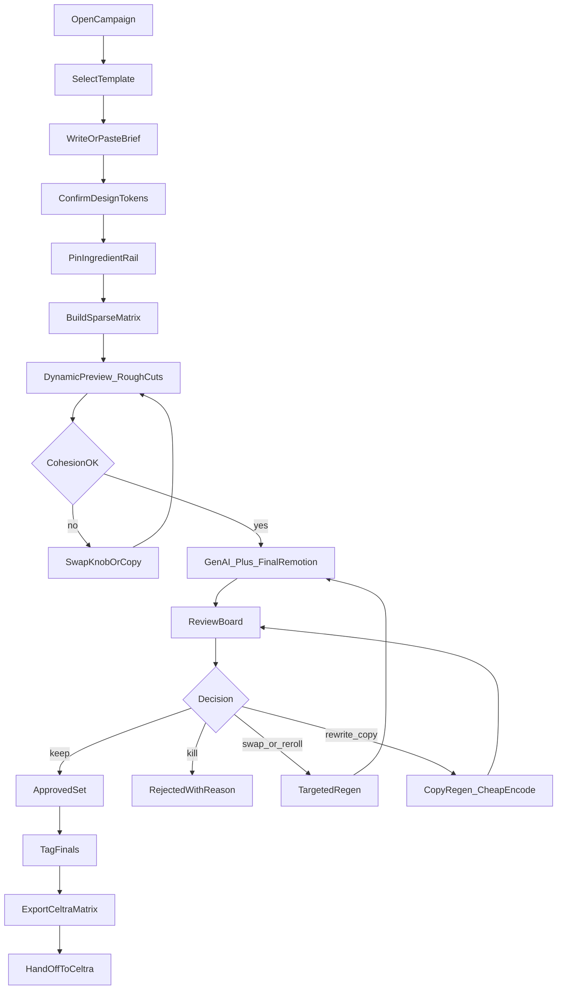
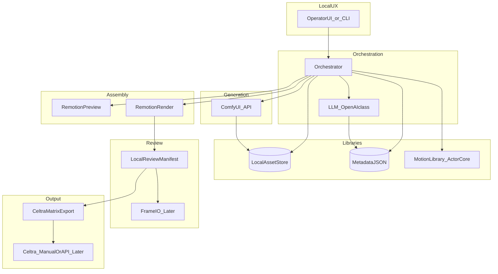
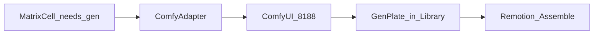

# ATTATTA — Workflow, UX & Integration Plan

**Audience:** performance marketer + designer (operators of the hopper)  
**Status:** Opinionated v1 for local PoC → production path  
**Related:** [PRD.md](./PRD.md) · [UX-UI.md](./UX-UI.md) · [assumptions.md](./assumptions.md) · [COMFYUI-INTEGRATION.md](./COMFYUI-INTEGRATION.md) · [CELTRA.md](./CELTRA.md) · [briefs/2026-08-05_architecture-diagrams.md](./briefs/2026-08-05_architecture-diagrams.md)

---

## 1. Operating thesis (marketer + designer)

You are not editing films. You are **testing a small set of levers** inside a fixed ad machine.

- **Template is law** — setup → punchline → end card never changes shape.
- **Talent face/voice/performance are frozen** — you pick takes; you do not invent Ted.
- **Volume comes from controlled knobs** — hands, background, attire, copy, motion tokens — not from infinite freeform gen.
- **Preview cheap, render expensive** — decide on rough cuts; spend GPU only on the matrix you intend to review.
- **Review is the creative job** — keep / kill / swap one knob / re-export. Packaging to Celtra is clerical.

If a variant needs a timeline editor, the template or brief failed — not the operator.

---

## 2. The variant knobs (constrained modular system)

### 2.1 What you may vary (client / brief controlled)

| Knob | Slot | Who supplies | How it changes | Risk |
|------|------|--------------|----------------|------|
| **Spokesperson take** | Setup | Library (Ted) | Select approved take / angle | Low — contract-safe |
| **Attire** | Setup (on talent) | Brief + Comfy wardrobe | Re-dress locked take | Medium — must not touch face |
| **Background** | Setup (behind talent) | Brief + Comfy BG | Re-site locked take | Medium — lighting match |
| **Hands / product** | Punchline | Library + Comfy | Product, grip, BG, performance | High flexibility — primary test surface |
| **Motion tokens** | Punchline / transitions | Motion library + template params | Gesture intensity, cut timing, ease curves | Medium — keep on rails |
| **Copy** | All beats + end card | Brief + LLM | Hook / punch / offer / CTA | High volume, brand-guarded |
| **Design tokens** | End card + chrome | Brand kit | Color, type, CTA style, optional social UI | Low if tokenized |

### 2.2 What you must not vary

- Face geometry, expression synthesis, lip sync rewrite  
- Voice clone / re-record via AI  
- Invented Ted performances not in the library  
- Off-template story structures  

### 2.3 Anti-explosion rule (matrix discipline)

Do **not** cross every knob × every knob. Marketers test with a **sparse matrix**:

1. Lock a **hero stack** (1 take + 1 attire + 1 BG + 1 motion preset).  
2. Fan out **one primary knob** per batch (usually hands **or** copy).  
3. Hold a small **secondary fan** (2–3 copy lines **or** 2–3 hand treatments).  
4. Cap a batch at **8–20 cells** unless spend is explicit.

**Default batch pattern (recommended):**

```text
1 hero spokesperson stack
× 3 hands/product treatments
× 3 copy lines
× 1 design-token pack
= 9 variants
```

Optional second batch: freeze winning hands+copy, fan attire **or** BG (2–3 each) — never both at once.

---

## 3. Best workflow (day-in-the-life)

### Phase A — Brief lock (10–20 min)

1. Pick **campaign template** (vertical paid social v1).  
2. Paste **prompt/brief** (scenario, tone, offer, CTA, must/must-not).  
3. Confirm **design token pack** + phone prop rule for this campaign.  
4. System extracts structured brief; operator fixes gaps.

**Exit:** `brief.json` + `tokens.json` approved.

### Phase B — Ingredient rail (10–15 min)

1. Library suggests Ted takes, hand alts, motion presets from tags.  
2. Operator pins **hero stack** + allowed substitutes (max 3 per knob).  
3. Mark which knobs are **open for this batch** (e.g. hands + copy only).

**Exit:** `ingredient_rail.json` (pinned IDs + open knobs).

### Phase C — Matrix plan (5 min)

1. Auto-build sparse matrix from rail + open knobs.  
2. Operator edits cells (drop duds, pin must-tests).  
3. Cost/time estimate shown before commit.

**Exit:** `matrix.csv|json` with cell IDs.

### Phase D — Dynamic preview loop (fast)

1. Remotion **rough cut** for selected cells (library plates, placeholder gen if needed).  
2. Operator watches for story cohesion: does setup earn the punchline? does end card land?  
3. Tweaks: swap take, rewrite one copy line, change motion token — **no full GenAI yet**.

**Exit:** matrix cells marked `preview_ok` | `preview_fix`.

### Phase E — GenAI + final render (slow path)

1. ComfyUI runs only for cells that need new hands / attire / BG.  
2. Remotion final encode with tokens + copy burn-ins.  
3. Auto QC: specs, contract flags, cohesion heuristic.

**Exit:** variant files + QC flags.

### Phase F — Review & re-edit (the real work)

Per variant actions (one click mental model):

| Action | Meaning | System does |
|--------|---------|-------------|
| **Keep** | Ship candidate | Status `approved` |
| **Kill** | Do not ship | Status `rejected` + reason |
| **Swap knob** | Change one component | Re-queue that cell with new ingredient |
| **Rewrite copy** | Copy-only regen | LLM + cheap re-encode |
| **Re-roll gen** | Hands/attire/BG again | ComfyUI with new seed/params |
| **Promote hero** | This stack becomes next batch baseline | Updates ingredient rail |

**Exit:** reviewed set.

### Phase G — Package (leave creative; enter distribution)

1. Post-approval tagging on finals.  
2. Build **Celtra-ready package**: approved MP4 masters + matrix (copy, CTA, URLs, lineage labels).  
3. Export folder/zip.  
4. **Hand to Celtra for distribution only** — trafficking / channel activation. Celtra does not re-decide hands, Ted takes, or story.  
   Detail: [CELTRA.md](./CELTRA.md).

---

## 4. UX flowchart

Full screen-by-screen writing, Comfy canvas decision, and visual rules: **[UX-UI.md](./UX-UI.md)**.  
**Locked:** operators never work on Comfy’s infinite node canvas; creative techs author workflows there; ATTATTA exposes semantic knobs only.

### 4.1 Primary operator flow



### 4.2 Screen map (what to build for great UX)

| Screen | Job | Key UI |
|--------|-----|--------|
| **1. Campaign home** | Pick template + open batch | Template cards; last matrices; status chips |
| **2. Brief** | One prompt + structured chips | Big prompt; offer/CTA chips; must-not list; “gaps” callout |
| **3. Tokens** | Confirm brand rails | Color/type/end-card preview; social chrome toggle |
| **4. Ingredient rail** | Pin constrained ingredients | Three columns: Talent / Hands / Motion; suggestions; lock icons on face/voice |
| **5. Matrix** | See combinatorial plan | Spreadsheet-like cells; open-knob highlighter; estimate cost/time; cap warning |
| **6. Preview bay** | Fast story check | Vertical player; beat markers (setup/punch/end); side panel = active knobs |
| **7. Render queue** | Trust the wait | Per-cell progress; QC badges; cancel/retry |
| **8. Review board** | Decide at volume | Grid of vertical thumbs; filters; Keep/Kill/Swap/Rewrite; compare 2-up |
| **9. Package** | Leave with matrix | Approved count; download zip; matrix preview table |

### 4.3 Review board interaction model (critical)

- Default sort: **QC pass first**, then unreviewed.  
- Clicking a thumb opens **knob inspector** (which take, hands ID, copy, tokens, motion).  
- **Swap** always changes **one** knob (prevents silent multi-drift).  
- **Compare** pins A/B sharing the same hero stack.  
- Keyboard: `A` approve, `X` reject, `R` rewrite copy, `S` swap hands, `N` next.

### 4.4 Constraint UX (make the rails visible)

- Face/voice locks shown as **non-editable badges** on talent cards.  
- Disabled controls explain *why* (“Contract: face locked”).  
- Matrix builder refuses illegal crosses (e.g. gen performance on Ted).  
- When operator tries “new scenario” that needs new lighting/performance → prompt to **request library shoot**, not fake it with AI.

---

## 5. Tool & API integration plan

### 5.1 Integration map by concern



### 5.2 What each tool owns (no overlap)

| Tool / API | Owns | Does not own |
|------------|------|--------------|
| **Operator UI / CLI** | Brief, rail, matrix edits, decisions | Model weights, final encode guts |
| **LLM (OpenAI-class)** | Brief parse, copy lines, cohesion score, tag labels | Video pixels, Remotion timeline |
| **Local asset store + metadata** | Ingredient files, locks, tags, lineage | Cloud DAM (later) |
| **Motion library** | Reference clips / animation presets as **tokens** | Full character performance of Ted |
| **ComfyUI** | Hands / attire / BG generative plates via node-graph API | Face/voice; final Mux; Celtra; story assembly |
| **Remotion** | Template composition, preview + final MP4, token application | Generative fill of Ted’s face |
| **Frame.io** (later) | Commenting, stakeholder review | Generation |
| **Celtra** | Distribution / trafficking / multi-channel activation | Variant creativity, talent/hands logic, sparse test matrix (see [CELTRA.md](./CELTRA.md)) |

### 5.2.1 ComfyUI — how it works in our stack

Full detail: [COMFYUI-INTEGRATION.md](./COMFYUI-INTEGRATION.md).

ComfyUI is a **local workflow engine** (default `http://127.0.0.1:8188`). The canvas UI and ATTATTA’s orchestrator are both clients of the same server.

```text
ATTATTA ComfyAdapter
  → optional POST /upload/image (product refs, masks, Ted plates)
  → PATCH allowlisted inputs on a versioned API-format workflow JSON
  → POST /prompt  { prompt, client_id }  → prompt_id
  → WS /ws progress  (executing / progress)
  → GET /history/{prompt_id} + GET /view  → library/gen/... + lineage sidecar
  → Remotion reads assetId for punchline / setup plates
```

Critical rules:

1. Submit **API-format** workflow JSON (not canvas UI JSON).  
2. Execution is **async** — never expect pixels in the `/prompt` response.  
3. Version workflows as artifacts (`hands_product_v1`, `talent_bg_v1`, …) and only patch mapped node inputs (seed, prompts, image refs).  
4. Preview prefers **library hits**; queue Comfy only for `needs_gen` / re-roll.  
5. Hard-block workflows flagged `touches_face` / `touches_voice` on locked talent.  
6. Auth: load `COMFY_API_KEY` from `.env` — Cloud uses `X-API-Key`; local Partner Nodes use `extra_data.api_key_comfy_org`. Never commit the key.  
7. Models are **profile-swappable** (`COMFY_MODEL_PROFILE` / batch `modelProfileId`); default **`z_image_turbo`**. See [`comfy/models.registry.json`](../comfy/models.registry.json).



### 5.3 Phased integration

#### Phase 0 — Local skeleton (now)

| Integration | Method | Acceptance |
|-------------|--------|------------|
| Asset library | Folders + `metadata.json` sidecars | Resolve ingredient by ID |
| Design tokens | `tokens.json` → Remotion props | End card reflects tokens |
| Matrix | CSV/JSON in / out | N cells → N jobs |
| Remotion preview | `@remotion/player` or low-res render | Rough cut &lt; interactive wait |
| Remotion final | `remotion render` CLI | Spec-correct 9:16 MP4 |
| Review | `review-manifest.json` | Keep/Kill/Swap recorded |
| Celtra package | Zip + `matrix.json` | Manual upload path documented |

**No:** Frame.io, Azure, Celtra API, platform publish. Comfy can stay stubbed with placeholder plates in Phase 0.

#### Phase 1 — Gen + language loop

| Integration | Method | Acceptance |
|-------------|--------|------------|
| LLM | API for brief→structure, copy set, cohesion | Operator can edit all outputs |
| ComfyUI | `ComfyAdapter` → `/prompt` + `/ws` + `/history` + `/view` on local `:8188` | Hands plates (then attire/BG) land in library with `promptId` lineage |
| Comfy workflows | Checked-in API-format JSON + `.map.json` param allowlists | `atta gen --workflow hands_product_v1` works |
| Tagging | Vision+LLM on ingest | Suggestions appear on Ingredient Rail |
| Orchestrator | Node/Python job runner | Resume failed cells; dedupe identical Comfy patch sets |

#### Phase 2 — Review hardening

| Integration | Method | Acceptance |
|-------------|--------|------------|
| Frame.io | Upload approved/pending + deep links | Comments map back to `variantId` |
| Review sync | Webhook/poll → ATTATTA statuses | Keep/Kill mirrored |

#### Phase 3 — Delivery (Celtra as distribution sink)

| Integration | Method | Acceptance |
|-------------|--------|------------|
| Celtra package | Approved MP4s + matrix/CSV per [CELTRA.md](./CELTRA.md) | Media ops can drop into Celtra without rebuilding ads |
| Celtra ingest | Confirm feed / design-file / API with CSM | 3-row sample lands and can be trafficked |
| Channels | **Only via Celtra** (Meta, etc.) | No ATTATTA-native publish |
| Celtra Export API | Optional later pull of launched outputs | Not required for PoC |

#### Phase 4 — Hosted north-star (explicitly later)

| Integration | Method | Notes |
|-------------|--------|-------|
| Azure (or equiv.) | Hosted workers for Comfy/Remotion | Journey-deck “Iterations” runtime |
| Auth / roles | Marketer vs creative | Self-service without dev |

### 5.4 API contracts (minimal, local-friendly)

**Orchestrator job (per matrix cell):**

```json
{
  "cellId": "cmp_spring_012",
  "templateId": "paid_social_9x16_v1",
  "knobs": {
    "talentTakeId": "ted_front_offer_03",
    "attireJob": null,
    "backgroundJob": "bg_park_soft_02",
    "handsJob": "hands_phone_swipe_a",
    "motionToken": "gesture_medium_v1",
    "copy": {
      "setup": "...",
      "punchline": "...",
      "endcard": "...",
      "cta": "Learn more"
    },
    "designTokenPackId": "brand_default_v3"
  },
  "stage": "preview|final",
  "lineage": {}
}
```

**ComfyUI job (via ComfyAdapter — see [COMFYUI-INTEGRATION.md](./COMFYUI-INTEGRATION.md)):**

```json
{
  "jobId": "gen_hands_cmp_spring_012",
  "workflowId": "hands_product_v1",
  "cellId": "cmp_spring_012",
  "knob": "hands",
  "patches": {
    "seed": 42,
    "productRef": "sku_phone_x.png",
    "motionToken": "gesture_medium_v1",
    "backgroundHint": "soft daylight desk"
  }
}
```

Adapter loads API-format workflow, maps semantic patches → node ids, `POST /prompt`, waits on WebSocket, writes `library/gen/...` + lineage (`promptId`, `workflowHash`, seed).

**Hard rule in orchestrator:** reject any Comfy workflow tagged `touches_face` or `touches_voice` for talent assets with locks.

### 5.5 Recommended defaults (opinionated)

| Concern | Choice | Why |
|---------|--------|-----|
| Assembly | **Remotion** | Template-as-code; preview + final; tokens as props |
| Gen variations | **ComfyUI** local | Parametric hands/attire/BG; matches PoC |
| LLM | **OpenAI-class** pluggable | Brief/copy/cohesion/tags |
| Motion tokens | **ActorCore-class** subset mapped to template enums | Constrained motion, not free puppetry |
| Review PoC | **Local manifest + folder** | Speed |
| Review prod | **Frame.io** | Stakeholder reality |
| Delivery | **Celtra package export first** (distribution sink) | Creative stays in ATTATTA; Celtra traffics |
| Hosting | **Defer** | Local until matrix loop is loved |

---

## 6. Quality bar for operators

A batch is successful when:

1. Every kept variant reads as **one story** (setup earns punch; end card is clear).  
2. Only **intended knobs** changed — lineage proves it.  
3. No talent lock violated.  
4. Matrix is sparse enough that a human can review in one sitting.  
5. Export is Celtra-ready without spreadsheet archaeology.

---

## 7. What to build first (sequence)

1. Remotion template with knobs as props (talent clip, hands clip, copy, tokens, motion enum).  
2. Matrix JSON → preview render → final render.  
3. Review board (even static HTML) over output folder.  
4. ComfyUI: author `hands_product_v1` (API format) + `ComfyAdapter` (`/prompt` → `/history` → library).  
5. Wire Review **Re-roll gen** to new seed on same workflow.  
6. LLM copy set + cohesion check.  
7. Celtra export schema (sample matrix).  
8. Attire/BG workflows behind the same adapter (face-protect maps).  
9. Frame.io + Celtra API when local loop is proven.

---

## 8. Doc links

| Doc | Role |
|-----|------|
| [PRD.md](./PRD.md) | Requirements source of truth |
| [assumptions.md](./assumptions.md) | Locks and guesses |
| [COMFYUI-INTEGRATION.md](./COMFYUI-INTEGRATION.md) | ComfyUI engine model, API, adapter, workflows |
| [CELTRA.md](./CELTRA.md) | Celtra research; creative vs distribution boundary |
| [UX-UI.md](./UX-UI.md) | Operator UI/UX writing; Comfy canvas vs simplified cockpit |
| [briefs/2026-08-05_architecture-diagrams.md](./briefs/2026-08-05_architecture-diagrams.md) | Journey vs Celtra diagram interpretation |
